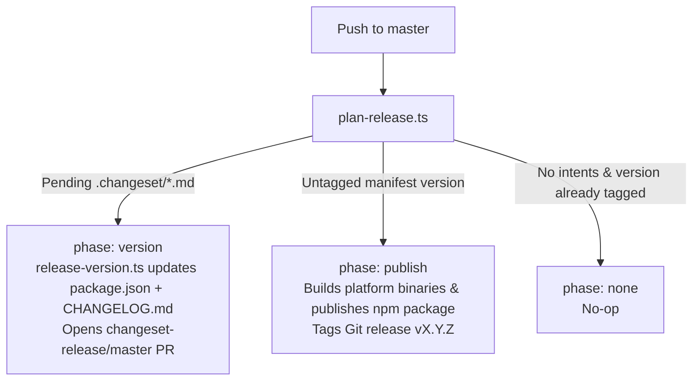

# Changesets

> Release intent store and automation contract for `@systemfsoftware/claude-code-comment-checker`.

This directory holds change-intent files consumed by the release pipeline on pushes to `master`. Every consumer-observable change must record its intent here so the automated release pipeline can bump package versions, generate changelogs, and publish platform binaries.



## Quick Start

Create a markdown file in this directory using pnpm 11's built-in command:

```bash
pnpm change --bump <none|patch|minor|major> --summary "<changelog entry>" [@systemfsoftware/claude-code-comment-checker]
```

Or write the file manually (`.changeset/<any-descriptive-name>.md`):

```markdown
---
'@systemfsoftware/claude-code-comment-checker': patch
---

Single paragraph in consumer voice explaining what is now observable or fixed.
```

## Intent Rules

- **Scope includes Rust core changes:** A PR that touches the Rust binary (`crates/comment-checker`) **must** include an intent. The crate compiles into the binary executed by the published npm launcher package; a change in the crate is directly observable by the package consumer.
- **Consumer voice:** Describe what the user of the hook or package observes. Never cite internal file paths, pull request numbers, or test names.
- **Single paragraph body:** The release script ([`scripts/tools/release-version.ts`](../scripts/tools/release-version.ts)) joins all lines in the summary body with spaces into a single changelog bullet item. Do not use multi-paragraph text or markdown sub-bullets.
- **`--bump none` for internal maintenance:** Use `none` only when no observable behavior changed (e.g., devDependency bumps, script edits, workflow refactoring).

## Release Pipeline Contract

Release automation is state-driven and runs on push to `master`:

1. **`phase: version`** — When pending intents exist in `.changeset/`, [`.github/workflows/release.yml`](../.github/workflows/release.yml) executes [`scripts/tools/release-version.ts`](../scripts/tools/release-version.ts), deletes the consumed intents, updates [`npm/packages/comment-checker/package.json`](../npm/packages/comment-checker/package.json) and [`npm/packages/comment-checker/CHANGELOG.md`](../npm/packages/comment-checker/CHANGELOG.md), and creates/updates a release pull request (`changeset-release/master`).
2. **`phase: publish`** — Merging the release PR updates `package.json` on `master` with an untagged version. The subsequent push to `master` enters the publish phase: `release.yml` builds cross-platform artifacts, attaches provenance attestations, publishes to npm, and creates the GitHub tag `vX.Y.Z`.
3. **`phase: none`** — When all intents are consumed and the current manifest version is already tagged, the pipeline exits clean with nothing to do.

> [!WARNING]
> Merging a pull request without an intent means `plan-release.ts` sees `phase: none`. The changes land on `master` but will never be published to npm or tagged as a release.

## Contributing

For general development workflow, gates, and contribution guidelines, see [AGENTS.md](../AGENTS.md) and [CONTRIBUTING.md](../CONTRIBUTING.md).
