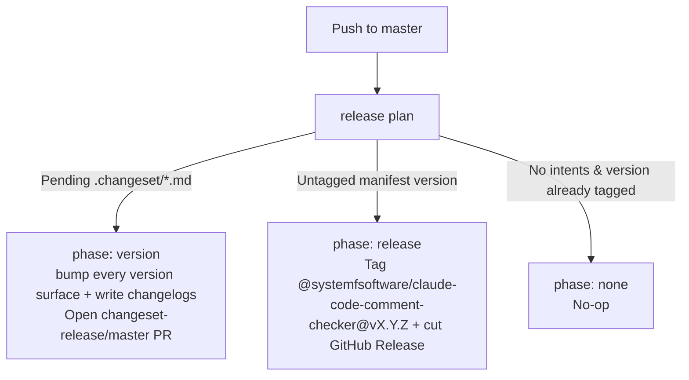

# Changesets

> Release intent store and automation contract for `@systemfsoftware/claude-code-comment-checker`.

This directory holds change-intent files consumed by the shared release
toolchain ([systemfsoftware/pnpm-release-management](https://github.com/systemfsoftware/pnpm-release-management))
on pushes to `master`. Every consumer-observable change must record its intent
here so the automation can bump the version surfaces, generate changelogs, tag
the release, and cut its GitHub Release. `release.jsonc` at the repository root
configures the toolchain.


```mermaid
flowchart TD
  Push[Push to master] --> Plan[release plan]
  Plan -->|Pending .changeset/*.md| Version[phase: version<br/>bump every version surface + write changelogs<br/>Open changeset-release/master PR]
  Plan -->|Untagged manifest version| Release[phase: release<br/>Tag @systemfsoftware/claude-code-comment-checker@vX.Y.Z + cut GitHub Release]
  Plan -->|No intents & version already tagged| None[phase: none<br/>No-op]
```

## Quick Start

Create a markdown file in this directory using pnpm 11's built-in command:

```bash
pnpm change --bump <none|patch|minor|major> --summary "<changelog entry>" [@systemfsoftware/claude-code-comment-checker]
```

Or write the file manually (`.changeset/<any-descriptive-name>.md`):

```markdown
---
'@systemfsoftware/claude-code-comment-checker': patch
---

Single paragraph in consumer voice explaining what is now observable or fixed.
```

## Intent Rules

- **Scope includes Rust core changes:** A PR that touches the Rust binary (`crates/comment-checker`) **must** include an intent. The crate compiles into the binary the launcher spawns; a change in the crate is directly observable by the consumer.
- **Consumer voice:** Describe what the user of the hook or package observes. Never cite internal file paths, pull request numbers, or test names.
- **Single paragraph body:** The toolchain joins all lines in the summary body with spaces into a single changelog bullet. Do not use multi-paragraph text or markdown sub-bullets.
- **`--bump none` for internal maintenance:** Use `none` only when no observable behavior changed (e.g., devDependency bumps, script edits, workflow refactoring).

## Release Pipeline Contract

Release automation is state-driven and runs on push to `master`; the phase is
derived from repository state, not from a pull-request ref:

1. **`phase: version`** — When pending intents exist in `.changeset/`, the toolchain bumps every version surface declared in `release.jsonc`, writes the changelogs, deletes the consumed intents, and creates or updates the release pull request (`changeset-release/master`).
2. **`phase: release`** — Merging the release PR lands an untagged version on `master`. The next push tags `@systemfsoftware/claude-code-comment-checker@vX.Y.Z` and creates its GitHub Release from the authored changelog. Distribution is this repository's Nix flake (built from source) at the tag — nothing is published to a registry.
3. **`phase: none`** — When all intents are consumed and the current manifest version is already tagged, the pipeline exits clean with nothing to do.

Releases through 0.3.6 predate the toolchain and are tagged `vX.Y.Z`. `release.jsonc` declares them as `legacyTags` (`v{version}` through `0.3.6`), so the plan counts those versions as released after reading each tag's commit and does not tag them again; every later release uses the `<name>@vX.Y.Z` form.

> [!WARNING]
> Merging a pull request without an intent leaves the plan at `phase: none`. The changes land on `master` but are never tagged or released.

## Contributing

For general development workflow, gates, and contribution guidelines, see [AGENTS.md](../AGENTS.md) and [CONTRIBUTING.md](../CONTRIBUTING.md).
