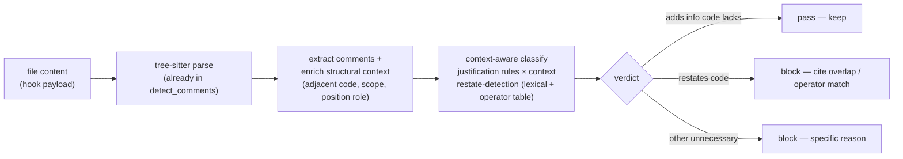

# State-of-the-Art Comment Adjudication - Plan

**Product Contract preservation:** changed — added **R5 (context-aware adjudication)** and enriched R1/R2 to require code context, per the user's "be more ambitious (under the current constraints)" directive. R3 (deterministic local engine) and R4 (recall) preserved; the ambition stays within all constraints. The adjudicator remains rule-based, not learned.

## Goal Capsule

- **Objective:** Make comment-checker the state-of-the-art comment adjudicator by judging each comment **against its code**, not in isolation — catching restatements with cited evidence, sparing comments that add information the code lacks, on a measurement foundation that makes quality visible.
- **Product authority:** User-directed. The author-LLM cannot be trusted to judge its own comments; the product is an independent adjudicator. "State of the art" means verdict *correctness* and *trustworthiness* (determinism, locality, airtightness).
- **Open blockers:** None.

## Problem Frame

The hook exists because the author-LLM is a biased judge of its own comments; the product is an independent adjudicator the author cannot sweet-talk. The adjudication authority — the Ousterhout/APOSD rubric the corpus is labeled against — is fundamentally about **the relationship between a comment and its code**: a good comment adds information the code lacks (lives at a *higher* abstraction level — why, constraints, invariants); a bad one restates the code at the *same* level.

The current classifier judges **comment text in isolation**. That is provably insufficient: you cannot detect "restates the code" without the code, so `RestatesCode` is today only a catch-all fallback (`crates/comment-checker/src/classify.rs:89`) that never compares a comment to anything. Meanwhile `detect_comments` (`crates/comment-checker/src/detect.rs:26`) already parses the full file into a tree-sitter Tree and then **discards it** after extracting comment text.

**The leap:** make the adjudicator *context-aware* — enrich each comment with its structural position, scope, and adjacent code from the AST already in hand, and classify the comment *against* that context. Deterministic, local, fast (tree-sitter is already in the path; no new parse), no network, rule-based not learned — within every constraint. It lifts both precision (spare a comment that adds info the code lacks) and recall (catch a restatement with *evidence* — the overlapping tokens — so the verdict is un-arguable).

Hard invariant (R3): the runtime adjudicator stays a deterministic local rule engine — no network, no LLM in the verdict path, not learned. The new context comes from the local AST.

**Scope constraint on edits:** `Write` gives the whole file, so full structural context. `Edit`/`MultiEdit` run `new_comments` (`check.rs:62`) on the edited fragment only, so context there is *fragment-bounded* — present but possibly incomplete at the fragment edge (a comment near the boundary may reference code outside the fragment). Context-aware rules must not convict on incomplete context; the text-only floor applies where context is unreliable.

## Requirements

- **R1 — Measurement foundation (eval as specification).** Quality measurable per-kind and per-language, with a confusion matrix, on a **context-bearing** single-source corpus (comment + adjacent code + position) that grows from real disagreements and carries **kind-level** ground truth (not just binary).
- **R2 — Precision moat (never convict a legitimate comment).** A comment that adds information the code lacks is spared; API-doc text is recognized in any comment type. Every flag's reason is specific and checkable.
- **R3 — Adjudication trust (deterministic local engine).** Runtime adjudicator is a deterministic local rule engine — no network, no LLM, not learned. Context comes from the local AST.
- **R4 — Recall lift.** Catch genuinely-unnecessary comments the rules miss by growing rule coverage from the living corpus — deterministically, with evidence, including paraphrased restatement (comment verb → code operator), not only literal token overlap.
- **R5 — Context-aware adjudication (the ambition).** The classifier reasons over comment-vs-code, not comment text alone: position, scope, and adjacent-code comparison drive the verdict.

Success criteria:

- The gate reports per-kind and per-language precision/recall on a single-source, context-bearing corpus.
- A comment that merely restates its adjacent code — literally or paraphrased — is flagged with the specific evidence cited.
- A comment that adds higher-abstraction info the code lacks (why, constraint, intent) is spared even when it shares surface words with the code.
- The runtime adjudicator remains a deterministic local binary — no network, no LLM, not learned.
- Context-aware rules degrade gracefully on `Edit`/`MultiEdit` (fragment-bounded context).

## Key Decisions

**KD1 — Sequencing: R1 (measure) → R5 (context-aware core) → R2 (precision) → R4 (recall), with R3 the invariant.** Measurement first; the context-aware core depends on a context-bearing corpus to be testable.

**KD2 — The adjudicator is a deterministic rule engine, not an LLM and not learned.** No LLM in the runtime path; context-aware ≠ learned — it is richer deterministic rules over richer input (the AST). The README's "rule-based, not learned" identity is preserved. *(session-settled: user-directed — chosen over a runtime LLM and over a bundled model: both violate the no-network / rule-based identity.)*

**KD3 — Binary verdicts with a rule-vocabulary reason plus evidence, not scored judgments.** A restatement flag cites the overlapping tokens, making it un-arguable.

## Key Technical Decisions

**KTD1 — The corpus becomes context-bearing, single-source, and kind-labeled.** Each case carries the comment, its adjacent code + position/scope, and a **kind-level** ground-truth label (the specific `UnnecessaryKind`/`Justification`), so per-kind precision/recall floors have ground truth to measure against — a binary Unnecessary/Justified label cannot produce per-kind floors. One source at `eval/corpus.json`, loaded by the test.

**KTD2 — Structural context is captured during the tree-sitter walk already happening.** `detect_comments` builds the full Tree; enrich each comment with its adjacent code text (the declaration/statement it precedes or sits in), scope (module / function / nested-block), and position role (docstring-head / leading / trailing / inline) during that walk. Zero new parsing.

**KTD3 — "Restates the code" becomes an evidence-backed comparison, not a fallback.** Tokenize the adjacent code (identifiers, operators, literals) and the comment; high lexical overlap with no higher-abstraction content (no intent/constraint/why marker) → `RestatesCode` with the overlapping tokens cited. A deterministic **synonym/operator table** maps comment verbs to code operators (`increment`↔`+=`, `decrement`↔`-=`, `assign`↔`=`, `returns`↔`return`) so *paraphrased* restatement is caught too — literal token overlap alone misses the common case. Still a static rule table: deterministic, local, rule-based. This is the precision+recall leap and the direct expression of Ousterhout's same-vs-higher-abstraction distinction.

**KTD4 — Justification is position/scope-aware.** A docstring at a public function's head is high-value even without `@param`; a restatement inside a loop body is noise. Context qualifies the verdict. API-doc markup is recognized in any comment type (not only `CommentType::Docstring`).

---

## High-Level Technical Design

The one new stage is **context enrichment (C)**, which rides on the parse that already happens. The classifier (D) changes from a text-only fold to a fold that also consumes context; the restate detector compares comment tokens to adjacent-code tokens lexically *and* via the synonym/operator table. All deterministic, all local.

---

## Implementation Units

### U1. Context-bearing single-source corpus and per-kind/per-language gate

**Goal:** Make quality measurable per-kind and per-language, on one canonical corpus that carries the code context and kind-level labels the new classifier needs.

**Requirements:** R1, R5.

**Dependencies:** None.

**Files:**
- `eval/corpus.json` — canonical source; case schema grows to include adjacent code + position/scope and a kind-level label.
- `crates/comment-checker/tests/common/mod.rs` — load from JSON; extend `F1`/`compute_f1` to a per-kind + per-language breakdown and confusion matrix.
- `crates/comment-checker/tests/f1.rs` — assert overall F1 ≥ 0.85 **and** per-kind floors.

**Approach:**
- Make `eval/corpus.json` the single source; the test loads it (`include_str!` + deserialize). Remove the embedded `CORPUS` duplicate.
- Grow the case schema: each case carries the comment, the adjacent code it annotates, its position/scope, language, comment type, and a **kind-level** ground-truth label (specific `UnnecessaryKind`/`Justification`) — not just binary. Per-kind floors require kind-level labels (KTD1).
- `compute_f1` accumulates tp/fp/fn per outcome kind and per language and emits a confusion matrix; the gate asserts per-kind floors, so a weak kind can't hide in the average.

**Test scenarios:**
- Loading JSON yields a context-bearing, kind-labeled case set; a newly appended case appears in the next run.
- The gate prints per-kind and per-language precision/recall.
- A deliberately reclassified case trips a per-kind floor even when overall F1 stays ≥ 0.85.
- Malformed JSON fails loudly; a kind with zero cases reports gracefully.

**Verification:** Gate shows the matrix; a forced per-kind regression fails the floor; exactly one corpus definition exists.

### U2. Structural-context extraction from the AST already parsed

**Goal:** Give the classifier the code context it currently throws away — adjacent code, scope, and position per comment — at no new parse cost.

**Requirements:** R5.

**Dependencies:** U1 (context shape is defined by the corpus schema).

**Files:**
- `crates/comment-checker/src/detect.rs` — `collect_comments`/`detect_comments` enrich each comment with context during the existing walk.
- `crates/comment-checker/src/comment.rs` — `Comment` (or a sibling context type) gains adjacent-code, scope, and position fields.
- `crates/comment-checker/src/check.rs` — thread context through `detect_for` → `flag_unnecessary`.
- `crates/comment-checker/src/classify.rs` — `classify` consumes context.

**Approach:**
- During the existing tree-sitter walk, capture per comment: the declaration/statement it precedes or sits in (adjacent code text), its scope (module / function / nested-block depth), and its position role (docstring-head / leading / trailing / inline).
- The Python docstring path (`collect_docstrings` / `PYTHON_DOCSTRING_QUERY`) captures only the docstring node; extend its query captures to also bind the adjacent declaration so Python docstrings get adjacent-code context, not just comment nodes.
- Carry these on the `Comment` (or a parallel context passed alongside). `classify` receives them.
- Degrade gracefully: context on `Edit`/`MultiEdit` is **fragment-bounded** — present but possibly incomplete at the fragment edge. Context-aware rules must not convict when the adjacent code is truncated at the fragment boundary; the text-only floor applies there.

**Execution note:** Build context extraction test-first against a few hand-built ASTs; confirm `Write` gets full context and `Edit` marks fragment-edge context as unreliable before touching the classifier.

**Test scenarios:**
- A docstring at a function head reports position `docstring-head` and the function signature as adjacent code.
- A trailing `// increment` inside a loop body reports scope = nested-block and the statement as adjacent code.
- An `Edit` fragment whose comment sits at the fragment edge reports context as unreliable (no conviction on incomplete adjacent code; text-only path used).

**Verification:** Context fields are populated for `Write`; fragment-edge context is flagged unreliable on edits, never silently trusted.

### U3. Context-aware "restates the code" detection with evidence

**Goal:** Make the context-aware comparison the primary restatement path — literal *and* paraphrased — while retaining a terminal text-only rule for zero-overlap filler comments.

**Requirements:** R4, R5 (R3 invariant).

**Dependencies:** U1, U2.

**Files:**
- `crates/comment-checker/src/classify.rs` — new restate detector consuming context; keep the text-only fallback as a terminal rule, not removed.
- `crates/comment-checker/src/comment.rs` — `UnnecessaryKind::RestatesCode` carries the cited overlapping tokens (evidence).
- `crates/comment-checker/src/report.rs` — render the cited tokens in the block report.

**Approach:**
- Tokenize the adjacent code (identifiers, operators, literals) and the comment.
- Two match paths produce `RestatesCode` evidence: **lexical** overlap of comment tokens with code tokens, and **operator** matches from the deterministic synonym/operator table (`increment`↔`+=`, `decrement`↔`-=`, `assign`↔`=`, `returns`↔`return`) per KTD3.
- High lexical/operator overlap *and* no higher-abstraction content (no intent/constraint/why marker, no API-doc markup) → `RestatesCode`, with the matched tokens cited as evidence so the report can show them.
- Zero-overlap filler — no lexical/operator match, no operator-table verb, no justification marker — is still flagged by a retained terminal text-only rule; the context-aware detector is the primary path, not the only path.
- A comment that shares words but adds info the code lacks (intent, constraint, invariant, "why") is **spared** — the overlap alone does not convict.
- Directional sketch (not spec): overlap = |comment_tokens ∩ code_tokens| / |comment_content_tokens|, gated below a tuned threshold and suppressed when any justification marker is present. Threshold tuned against the corpus and locked by a per-kind floor.

**Execution note:** Tune the overlap threshold against U1's corpus; the per-kind precision floor is the acceptance gate, not a guessed constant.

**Test scenarios:**
- `// counter` next to `counter += 1` → flagged, citing `counter` (lexical overlap).
- `// increment the counter` next to `counter += 1` → flagged, citing `counter` (lexical) and `increment`↔`+=` (operator table) — paraphrased restatement caught.
- `// throttle to avoid the rate limit` next to the same line → **spared** (adds a constraint/why the code lacks), even though it shares words.
- `// returns the user` next to `fn user()` → flagged (restates signature), citing `user` (lexical overlap).
- A justified comment with incidental word overlap is not convicted (precision floor holds).
- Mutation score on `classify.rs` stays 100%.

**Verification:** Per-kind recall on `RestatesCode` rises; precision floor holds; each flag cites tokens; mutants green.

### U4. Position/scope-aware justification and API-doc in any comment type

**Goal:** A comment's legitimacy judged by where it sits, and API-doc text recognized regardless of comment syntax.

**Requirements:** R2.

**Dependencies:** U2.

**Files:**
- `crates/comment-checker/src/classify.rs` — `is_public_api_doc` uses position/scope; recognize DOC_MARKUP in any comment type at line-start.
- `crates/comment-checker/tests/common/mod.rs` — corpus cases.

**Approach:**
- `is_public_api_doc` (classify.rs:139) currently requires `CommentType::Docstring`; broaden to also accept a docstring-*position* (head of a public declaration, per U2) and DOC_MARKUP at line-start in any comment type.
- Position-aware: a restatement at a function head may still be a legitimate interface comment; a restatement inside a body is noise. Context qualifies the verdict.

**Test scenarios:**
- `# Returns: the user` (Line, Ruby/R) → `Justified { PublicApiDoc }`.
- A docstring-head comment on a public function is recognized as interface doc.
- A prose comment mentioning `@param` mid-sentence is not over-justified.
- Precision floor holds or improves.

**Verification:** Per-kind precision unchanged or improved; non-docstring API docs no longer false-convicted.

### U5. Recall growth from the living context-bearing corpus

**Goal:** Catch unnecessary-comment shapes the current kinds miss, now powered by code context.

**Requirements:** R4.

**Dependencies:** U1, U3.

**Files:**
- `crates/comment-checker/src/comment.rs` — new `UnnecessaryKind` variant(s).
- `crates/comment-checker/src/classify.rs` — new predicate(s) + marker table, context-using.
- `crates/comment-checker/tests/common/mod.rs` — corpus cases.

**Approach:**
- Mine the living context-bearing corpus and real disagreements for shapes not covered (AgentMemo, CommentedOutCode, VacuousTodo, RestatesCode), per Ousterhout.
- Candidate kinds (directional — confirm against the corpus): *narrates control flow* (`// loop and filter` beside the loop), *narrates the signature* (`// count: int` beside `count: int`). Context (U2) makes these detectable with evidence.
- Deterministic, local, mutation-tested.

**Execution note:** Confirm each candidate against the corpus before encoding it; do not add speculative kinds.

**Test scenarios:**
- A corpus case of each new kind is flagged with its specific reason.
- A justified comment sharing surface markers is not mis-flagged (precision floor holds).
- Mutation score on `classify.rs` stays 100%.

**Verification:** Per-kind recall improves; precision floor holds; mutants green.

---

## Risk Analysis & Mitigation

- **Restate-detection over/under-fires (U3, highest risk).** *Mitigation:* the per-kind precision *and* recall floors (U1) gate it; the threshold is tuned against the corpus, not guessed; mutation testing on `classify.rs` pins behavior. Ship behind the floor, not a constant.
- **Fragment-bounded context on `Edit`/`MultiEdit` (U2).** *Mitigation:* context is flagged unreliable at the fragment edge; the text-only rule floor remains, so edits never regress below today's behavior and never convict on incomplete adjacent code.
- **Corpus schema growth is a one-time migration (U1).** *Mitigation:* the existing 50 text-only cases each get their adjacent code **authored** and their label **re-verified** under the context-aware, kind-level rubric — not a purely mechanical migration; the gate proves parity before any classifier change lands.
- **Ambition creep beyond one plan.** *Mitigation:* file-level / cross-comment signals (duplicate docstrings, section-header runs) are deferred — this plan's core is per-comment adjacent-code context.

## Verification Contract

Run in order (fail fast):

1. `cargo fmt --check && cargo clippy --all-targets -- -D warnings && cargo test --all-targets` (repo gate).
2. The per-kind + per-language confusion-matrix gate (U1) is green, including per-kind floors.
3. `cargo mutants --file crates/comment-checker/src/classify.rs --timeout 90` stays 100% (U2–U5 change the classifier).

## Definition of Done

- Context-bearing, kind-labeled single-source corpus + per-kind/per-language confusion-matrix gate live (U1).
- Each comment carries structural context (adjacent code, scope, position) from the AST already parsed, flagged unreliable at fragment edges (U2).
- "Restates the code" is an evidence-backed comparison — the primary path — with a terminal text-only rule retained for zero-overlap filler (U3).
- Justification is position/scope-aware; API-doc markup works in any comment type (U4).
- At least one new recall kind is mined and added (U5), or the corpus analysis documents that no new kind is justified.
- Mutation score on `classify.rs` is 100%; repo gate is green; the adjudicator is unchanged as a deterministic, local, rule-based binary (R3).

## Assumptions

- (Auto-proceeded scoping gate per the user's standing "stop asking" + explicit "be more ambitious" directive.) The overlap threshold for U3 is a corpus-tuned value, locked by the per-kind floor — not a plan-time constant.
- The corpus schema grows once; the existing cases' adjacent code is authored and their labels re-verified during that migration.

## Open Questions (deferred to implementation)

- The concrete overlap metric, operator-table coverage, and threshold for U3 — tuned against the corpus, locked by the floor.
- Whether `Edit`/`MultiEdit` can ever recover fuller context (e.g., reading the file on disk) — out of scope here; fragment-bounded context is the floor.
- Whether `#`/`--` API-doc comments need AST "is-above-a-declaration" context vs the line-start heuristic (U4) — start heuristic-first.
- File-level / cross-comment signals (duplicate docstrings, section-divider runs) — deferred to a follow-up.

## Scope Boundaries

### In scope
- Context-aware adjudication: structural context extraction + evidence-backed restate detection (lexical + operator table) + position/scope-aware justification.
- Context-bearing, kind-labeled single-source corpus + per-kind/per-language confusion-matrix gate.
- Recall growth via new deterministic, context-powered rules.

### Out of scope / Deferred to follow-up
- File-level / cross-comment signals (duplicate docstrings, section-divider runs).
- Any LLM or learned model in the runtime verdict path (rejected: violates R3 and the rule-based identity).
- Adding languages beyond the current 37; the npm distribution layer; the hook contract / exit codes; the `--prompt` UX.

## Sources & Research

- `software-wiki/entities/eval-criteria-design.md` — eval as specification; living golden set; binary verdicts with reasoning; calibrate for correct triggers, not more.
- `software-wiki/entities/ousterhout-aposd-extract.md` — the rubric the corpus is labeled against: good comments live at a higher abstraction level than the code (add info it lacks); bad ones restate it. This is the authority for context-aware adjudication.
- Codebase: `crates/comment-checker/src/detect.rs` (full Tree built, then discarded), `crates/comment-checker/src/classify.rs` (text-only fold; `RestatesCode` is a fallback at line 89), `crates/comment-checker/src/comment.rs` (`Comment`/`CommentType`/`UnnecessaryKind`), `crates/comment-checker/src/check.rs` (`Write` full content; `Edit`/`MultiEdit` fragment-only via `new_comments`), `crates/comment-checker/tests/common/mod.rs` (corpus + `compute_f1`), `crates/comment-checker/tests/f1.rs` (single-F1 gate).
