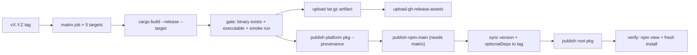
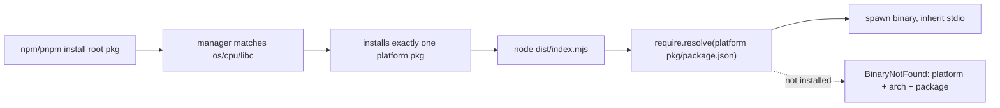

# npm Distribution Release - Plan

## Goal Capsule

- **Objective:** Publish the first npm release of comment-checker — five platform binary packages plus a root launcher package, shipped by a tag-triggered GitHub Actions release pipeline with OIDC provenance, no install-time scripts, and verified installs.
- **Product authority:** User-directed. The user confirmed the distribution scope ("OK plan the release of this thing") on 2026-08-17; the distribution pattern (per-platform packages + `optionalDependencies`, Node launcher) was examined in-session and accepted. Publishing to npm under the `systemfsoftware` org is a human-controlled action per AGENTS.md — the pipeline stages everything; a human cuts the tag.
- **Open blockers:** None. npm trusted-publisher entries (one per package, six total) and the package names require one-time org-admin setup, owned by the first-release checklist (U5).
- **Stop conditions:** the plan is done when `v0.1.0` is live on npm with provenance, a fresh install on Linux and on one of macOS/Windows runs the real binary, and `--ignore-scripts` installs still work.

---

## Summary

Comment-checker is a Rust CLI distributed today via `cargo install` and GitHub-release tarballs. This plan lands the npm distribution layer built in `npm/packages/comment-checker/`: five per-platform binary packages named `@systemfsoftware/claude-code-comment-checker-<os>-<arch>`, and a root launcher package `@systemfsoftware/claude-code-comment-checker`. Package managers install exactly one platform package per machine; the Node launcher resolves and spawns it. The release pipeline rebuilds the un-merged `feat/npm-optional-dependencies` branch work with its gaps fixed: a tag-triggered GitHub Actions workflow publishing platform packages first, then the root, all with OIDC provenance and no static token.

## Problem Frame

A Claude Code hook distributed via npm must give each user a working native binary with zero friction and zero install-time execution. The previous distribution experiments (`feat/npm-optional-dependencies`, `feat/modern-npm-distribution-pnpm-11`) produced an implemented launcher and a draft release workflow but never merged: the current tree has no launcher manifest, no release workflow, and no published packages. The SOTA classifier plan (`docs/plans/2026-08-12-002-feat-sota-comment-adjudication-plan.md`) explicitly deferred the npm distribution layer to follow-up. The npm layer changes no Rust code; it makes the binary installable.

**Premise for this release.** The audience is Claude Code hook users, and Claude Code runs on Node — every hook user therefore already has a Node runtime, while `cargo install` demands a Rust toolchain this audience commonly lacks. The existing paths (cargo install from git, GitHub tarballs) stay live for Rust users and for non-npm sinks; npm closes the gap for the primary audience at zero install-time code execution. The release decision is user-directed in-session; demand validation (download counts vs the cargo-install era, install-friction issues) is tracked as an open adoption signal after `v0.1.0` rather than a precondition.

## Requirements

**Packaging**

- R1. Per-platform packages. Exactly one npm package per supported target, named `@systemfsoftware/claude-code-comment-checker-<os>-<arch>`, containing only the native binary and a manifest declaring `os`/`cpu` (`libc` on Linux, see KTD4). Binary name is `comment-checker` on POSIX, `comment-checker.exe` on Windows.
- R2. Root launcher package. `@systemfsoftware/claude-code-comment-checker` exposes `bin` → the built ESM launcher, ships only the built launcher in `files`, and runs no `postinstall` or any install-time script.
- R3. Install-time selection. A plain install on Linux x64 installs exactly `…-linux-x64` and yields a working binary. Supported: Linux (x64, arm64), macOS (x64, arm64), Windows (x64).

**Release pipeline**

- R4. Tag-triggered publish. Pushing tag `vX.Y.Z` builds the release binary for all five targets, publishes the five platform packages then the root package at version `X.Y.Z`, with `optionalDependencies` pinned to that exact version (never a range).
- R5. Trusted publishing. All publishes use OIDC (`id-token: write`) and npm provenance; no static token is stored in CI or repo.
- R6. GitHub release tarballs. The per-target `.tar.gz` archives remain attached to the release for non-npm users.

**Verification**

- R7. Every platform's binary is smoke-tested before publish; the published root is verified after publish; the launcher resolution is covered by automated tests.

**Documentation**

- R8. README install/publish claims match the live state after the first release, and maintainers have documented publish steps (tag flow, trusted-publisher setup, post-publish verification).

## Key Decisions

- KD1 — Ship the README-documented matrix (5 targets: Linux x64/arm64, macOS x64/arm64, Windows x64). No musl, no win32-arm64 in the first release; matches the README/FAQ, prior plan, and workflow drafts.
- KD2 — No install-time download or fallback. A missing binary fails cleanly with `BinaryNotFound` naming the platform. Chosen over a Sentry-style postinstall fallback: the fallback reintroduces network access and script execution at install time, and the launcher's current behavior already satisfies this. *(session-settled: user-approved — chosen over an install-time download fallback: keeps zero install-time network/script execution.)*
- KD3 — Provenance on every published package and no static tokens (OIDC identity from the Actions runner).
- KD4 — Distribution via per-platform packages + `optionalDependencies` in a root launcher package. *(session-settled: user-approved — chosen over single-package postinstall download and all-platforms-in-one-tarball: managers select one platform package natively, no install scripts.)*
- KD5 — The package entry is a Node launcher. *(session-settled: user-approved — chosen over Deno/Bun shims: npm/pnpm/yarn are Node programs, so Node is the one runtime the distribution channel guarantees.)*

---

## Planning Contract

### Key Technical Decisions

- **KTD1 — Pin the Effect v4 RC deps to the vendored revision.** The launcher depends on `effect@4.0.0-rc.108` and `@effect/platform-node@4.0.0-rc.108` — the exact versions matching the `repos/effect` subtree — resolved from the npm registry by pnpm and bundled by tsdown from the installed packages (which ship TS source; `node:` built-ins stay external). The vendored subtree is reference only, never a build input. *(Alternative rejected: `file:`-linking the vendored subtree's packages into the pnpm workspace — pulls a multi-package upstream subtree into the workspace and inflates install.)* The published surface is the packed tarball, not the workspace build; the rehearsal verifies `npm pack` output per package (U3, Verification Contract).
- **KTD2 — One canonical targets table.** `scripts/release/targets.json` declares the five targets (triple, suffix, `os`/`cpu`/`libc`, bin name). The manifest generator and the workflow's matrix check consume it; a unit test keeps it consistent. The launcher derives package/group names by identity from `process.platform`/`process.arch`, so the only drift surface is the table vs the workflow matrix, closed by a workflow check step (`check-matrix`).
- **KTD3 — Release workflow shape.** `push: tags ['v*']` → one `release` job per target in a 5-row matrix (build, gate, smoke, tar.gz upload, then publish the platform package via `pnpm publish --provenance`), then `publish-npm-main` (`needs: release`) installs frozen lockfile, builds the launcher, syncs versions from the tag, and publishes the root; `upload-gh-release-assets` attaches tarballs. The un-merged draft workflow is precedent; this shape adds the pre-publish gate and smoke, and a tested version-sync script.
- **KTD4 — Linux packages declare `"libc": ["glibc"]`.** Without it, musl/Alpine users (also `linux-x64`) install the glibc binary and hit a loader crash at runtime instead of the intended clean `BinaryNotFound`. Modern npm and pnpm honor the `libc` field and skip a mismatched platform package.
- **KTD5 — The Git tag is the single version source.** The workflow rewrites launcher `version` and every `optionalDependencies` value to the tag version via a tested script; the committed manifest may lag behind (stays at `0.1.0` until the first bump). Full version automation is deferred.

### High-Level Technical Design

**Target matrix**

| Target | Runner | Suffix | os | cpu | libc | Bin |
|---|---|---|---|---|---|---|
| `x86_64-unknown-linux-gnu` | ubuntu-latest | `linux-x64` | linux | x64 | glibc | `comment-checker` |
| `aarch64-unknown-linux-gnu` | ubuntu-latest + cross linker | `linux-arm64` | linux | arm64 | glibc | `comment-checker` |
| `x86_64-apple-darwin` | macos-13 | `darwin-x64` | darwin | x64 | — | `comment-checker` |
| `aarch64-apple-darwin` | macos-14 | `darwin-arm64` | darwin | arm64 | — | `comment-checker` |
| `x86_64-pc-windows-msvc` | windows-2022 | `win32-x64` | win32 | x64 | — | `comment-checker.exe` |

**Release flow**

**Consumer path**

### Assumptions

- The npm org admin pre-creates trusted-publisher entries for all six packages and the five package names are available; missing setup fails fast at publish.
- The `systemfsoftware` npm identity is authorized to publish all six names. The human who cuts the tag is the authority gate per AGENTS.md.
- `pnpm-workspace.yaml` (packages `npm/packages/*`) stays unchanged; the launcher resolves Effect from the registry pinned at KTD1.
- Node `>=18` is the launcher floor (matches `@effect/platform-node` engines); CI gate runs node 20; publish jobs run Node 24 (npm ≥ 11.5.1 required for trusted publishing).

---

## Implementation Units

### U1. Launcher package manifest + workspace lockfile

**Goal:** Give `npm/packages/comment-checker/` a valid publishable manifest and make pnpm workspace build/typecheck/install work.

**Requirements:** R2, R3.

**Dependencies:** none.

**Files:**
- `npm/packages/comment-checker/package.json` — create
- `npm/packages/comment-checker/tsdown.config.ts` — confirm the single ESM output builds from the Effect source with `node:` built-ins external; adjust only if the Effect source breaks the single-file build
- `pnpm-lock.yaml` — generate and commit the root lockfile (none exists today; a first non-frozen `pnpm install` produces it, and the CI `--frozen-lockfile` steps only hold once it is committed)
- `package.json` (root) — unchanged

**Approach:**
- Author the manifest (it does not exist in this worktree; the `feat/npm-optional-dependencies` variant is precedent only): `name: "@systemfsoftware/claude-code-comment-checker"`; `bin: { "comment-checker": "./dist/index.mjs" }`; `files: ["dist"]`; `scripts: { "build": "tsdown", "typecheck": "tsc -p tsconfig.json --noEmit" }` (satisfies the root `pnpm -r build`/`typecheck`); no `postinstall`/`prepare`; no `private` field (the workspace root's `private: true` does not propagate); `dependencies`: `effect` + `@effect/platform-node` pinned `4.0.0-rc.108` (KTD1); `@types/node` as devDependency; `engines: { "node": ">=18" }` (verified at rehearsal — the floor is asserted until `dist` runs on Node 18, not inherited); `publishConfig: { access: "public", provenance: true }`; `optionalDependencies` listing the five suffixed names at the package version.
- Replace the hardcoded `version: "0.1.0"` in the launcher with a runtime read of the launcher's own `package.json` (via `createRequire`) so `comment-checker --version` can never drift from the published manifest (KTD5); `src/index.ts` is edited in U1, `sync-root-version.mjs` stays the only external writer.
- Generate the lockfile with a first non-frozen `pnpm install` pinned to the canonical registry (`--registry https://registry.npmjs.org`) at the workspace root; commit it; thereafter frozen installs in CI only — the lockfile is never regenerated arbitrarily.
- Verify `pnpm -r build` emits `dist/index.mjs` and `pnpm -r typecheck` passes with the Effect language-service rules intact.

**Approach detail:** the launcher source already implements `optionalDepName(platform, arch)` returning `@systemfsoftware/claude-code-comment-checker-<platform>-<arch>` — keep it; the manifest must list exactly those names.

**Test scenarios:**
- Manifest assertions: no `postinstall`; `files` = `["dist"]`; `optionalDependencies` has five entries equal to the launcher's name convention; `publishConfig.provenance` true; `engines.node` = `">=18"`.
- `pnpm -r build` and `pnpm typecheck` succeed; `dist/index.mjs` exists.
- Running `node dist/index.mjs` on a machine without the platform package exits non-zero and prints `BinaryNotFound` naming the expected package.

**Verification:** `pnpm -r build` + the `BinaryNotFound` smoke (until the platform package exists, that is the expected launcher behavior; at release it must not trip). Also: `pnpm lint` stays green once the new `scripts/` and `tests/` files exist (U2/U4 own that surface), and the built `dist/index.mjs` runs on Node 18 (rehearsal proves this — engines is asserted, not inherited).

### U2. Release scripts and unit tests

**Goal:** Extract platform-manifest generation and version sync into tested scripts behind `targets.json`, so the workflow is thin and verifiable without a real release.

**Requirements:** R1, R4, R7.

**Dependencies:** U1 (manifest shape); defines the five names U1 must list.

**Files:**
- `scripts/release/targets.json` — five entries `({ target, suffix, os, cpu, libc?, bin })`.
- `scripts/release/generate-platform-manifest.mjs` — given a suffix and version, emits the platform package.json: name, version, description, license, repository, os/cpu, libc when the table says so, files `[bin]`, and `publishConfig: { access: "public", provenance: true }` (mirrors the launcher manifest so provenance attaches even if an operator publishes without the `--provenance` flag). Supports `--dry-run` (prints, does not write).
- `scripts/release/sync-root-version.mjs` — rewrites the launcher manifest's `version` and all `optionalDependencies` values from a `VERSION` env; validates the value against `^\d+\.\d+\.\d+(-[A-Za-z0-9.-]+)?$` and errors before any write on a malformed tag (no inline `node -e` JSON concatenation anywhere — the script is the only writer). Dry-run prints the diff.
- `scripts/release/check-matrix.mjs` — asserts the five table entries and the workflow matrix agree (os/cpu derivable from suffix by identity).
- `tests/release/release-scripts.test.mjs` — `node:test` suite.

**Approach:**
- Dependency-free Node scripts; `node:test` runner (Node 18+ built-in), no new toolchain.
- `targets.json` is the single source for suffix → os/cpu/libc; `check-matrix` and the unit tests keep it consistent with the launcher's identity naming (KTD2).
- Brownfield note: neither `scripts/` nor `tests/` exists at repo root today — the entire `scripts/release/` and `tests/release/` trees are net-new; no precedent path is reused from the un-merged branch.

**Test scenarios:**
- For each of the five table entries: `generate-platform-manifest` emits a manifest with correct os/cpu/libc/bin, name `@systemfsoftware/claude-code-comment-checker-<suffix>`, `libc` present only for linux entries, `.exe` bin on win32.
- `--dry-run` leaves no files changed (tree identical before/after).
- `sync-root-version` with `VERSION=0.1.0` sets `version` + all five optionalDependencies to `0.1.0`; with `0.2.0` the only diff is the version fields.
- Malformed tag values (`v0.1.0"`, `0.1.0\n--provenance=false`, `not-a-version`) → `sync-root-version` exits non-zero and writes nothing (semver gate).
- Unknown suffix → error listing the five supported suffixes.
- `check-matrix` fails when a table entry's os/cpu is inconsistent with the identity convention; passes otherwise.

**Verification:** `node --test tests/release` green.

### U3. Release workflow

**Goal:** The GitHub Actions pipeline that builds, gates, publishes all six packages, and attaches tarballs.

**Requirements:** R1–R7.

**Dependencies:** U1, U2.

**Files:**
- `.github/workflows/release.yml` — create (supersedes the un-merged draft on `feat/npm-optional-dependencies`).
- `.github/workflows/ci.yml` — unchanged; note in the new file that release flows from tags, not from CI (which gates `main`).

**Approach:**
- Workflow-level `permissions: {}` — nothing inherited; each job grants only what it needs. `release` matrix jobs: `id-token: write` (npm OIDC); `upload-gh-release-assets`: `contents: write` via the default `GITHUB_TOKEN` only (no PAT, no per-job secrets — re-stated in the DoD); `publish-npm-main`: `id-token: write`.
- `concurrency: { group: release-${{ github.ref }}, cancel-in-progress: false }` at workflow level — two simultaneous tag pushes must never race the publish (npm versions are immutable; cancelling mid-publish would strand a half-published root). `cancel-in-progress: false` is deliberate.
- Publish jobs use `actions/setup-node@v4` with `node-version: 24` (npm ≥ 11.5.1 is required for trusted-publishing OIDC) and `registry-url: https://registry.npmjs.org` — the registry URL is what wires the npm OIDC exchange; do NOT set `NODE_AUTH_TOKEN` (an empty token line overriding OIDC is the documented breakage). `dtolnay/rust-toolchain@stable` with the target; linux-arm64 installs `gcc-aarch64-linux-gnu` and sets `CC_aarch64_unknown_linux_gnu`/`CARGO_TARGET_AARCH64_UNKNOWN_LINUX_GNU_LINKER`/`AR_aarch64_unknown_linux_gnu` (env-var approach keeps the `.cargo/config.toml` `[env]` intact for TSLP_LINK_MODE=static). Cargo cache key includes the matrix target (`${{ runner.os }}-${{ matrix.target }}-cargo-…`) so linux x64/arm64 do not thrash one cache.
- Action pinning: every third-party action is declared by tag name in this plan for identification, and pinned to its full commit SHA in the workflow file (per DoD); the SHA → tag mapping lives in the U5 maintenance duty alongside a dependabot `github-actions` group so pins are updated deliberately.
- Tag-gate before any publish (top of `publish-npm-main` and re-checked in the matrix): derive `VERSION` from `${GITHUB_REF#refs/tags/v}` and reject anything failing the semver pattern (U2's gate) — exit non-zero before any write or publish. Also verify the tag's commit is reachable from the default branch (`git merge-base --is-ancestor <sha> <default-branch>`) so a stray tag can't publish un-reviewed content.
- Gate before platform publish (per target): `check-matrix` assertion; binary exists; binary is executable (POSIX); smoke — pipe the README's clean payload (expect exit 0) and one flagged payload (expect exit 2); record `binarySha256` (from `sha256sum` of the exact staged binary) into the generated manifest and upload a sidecar artifact.
- Publish platform: stage in a temp dir **outside** the workspace (`$RUNNER_TEMP/…`) with `generate-platform-manifest` + the binary; dependency-free manifests need no `pnpm install`, and staging out-of-tree avoids workspace-context surprises; then `pnpm publish --provenance --access public` from that dir.
- After the matrix, before the root publish, `publish-npm-main` re-verifies the registry: `npm view <name>-<suffix>@<tag> version os cpu libc` for all five suffixes — equality with `targets.json`, plus the `npm pack` + `sha256sum` cross-check against the recorded `binarySha256`. Any mismatch fails the run before the root publish (the root's `optionalDependencies` must not point at missing packages).
- Then: `pnpm install --frozen-lockfile` (registry pinned), `pnpm -r build`, `VERSION=… node scripts/release/sync-root-version.mjs` (tested script; no inline `node -e`), `pnpm publish --no-git-checks --provenance --access public` from the launcher dir → verify root via `npm view` (exact optional pins + provenance available).
- `upload-gh-release-assets` (`needs: release`, `permissions: { contents: write }`): `actions/download-artifact@v4` with `pattern: release-*`, `merge-multiple: true`; attach via `softprops/action-gh-release@v2` (SHA-pinned). `actions/attest-build-provenance` for the tarballs is deferrable hardening.
- Inline comment on the `on:` block: fork safety derives from `push: tags` (only repo writers push tags); `pull_request_target` is intentionally not used; the trusted-publisher record binds workflow filename + environment, not tag patterns (the `on:` filter is the tag gate — see U5).

**Test scenarios:** (unit) none — pure CI config; the behavioral contract is the rehearsal and first release in the Verification Contract.
**Acceptance (non-unit):** the gate must fail fast when the binary is missing; a non-semver tag must fail before any publish; the root must never be published when any platform package is absent or when a `binarySha256` cross-check fails (ordering gate).

**Verification:** rehearsal per Verification Contract; first real tag publishes and the `npm view`/fresh-install checks pass. The packed tarball — not the workspace build — is the surface consumers install, so the rehearsal verifies the `pnpm publish --dry-run`/`npm pack` output per package; provenance is only provable on the real publish.

### U4. Launcher integration tests

**Goal:** Prove resolver+spawn end-to-end against fixtures — and pin the platform-name convention shared with the release tooling.

**Requirements:** R2, R3, R7.

**Dependencies:** U1 (build output).

**Files:**
- `npm/packages/comment-checker/src/platform.ts` — extract pure helpers `platform`/`arch`-derived names (`optionalDepName(platform, arch)`, `binaryFileName(platform)`) that `index.ts` uses; add a second tsdown entry so tests can import `dist/platform.mjs` without executing the CLI. The module must import no Effect client (`effect`, `@effect/*`) — the `@effect/language-service` floatingEffect rule is error in this tsconfig and the module must stay pure.
- `tests/npm-launcher/launcher.test.mjs` — `node:test` black-box suite driving `node dist/index.mjs`.

**Approach:**
- Black-box: fixture dir `node_modules/@systemfsoftware/claude-code-comment-checker-<host-suffix>/` with a fake `package.json` + a shim `comment-checker` script (echoes args, exits with a chosen code); run under `NODE_PATH=<fixture>` so `createRequire` resolution finds it.
- Negative: no fixture → `BinaryNotFound` with the exact package-name suffix, os, arch; non-zero exit.

**Test scenarios:**
- Happy path: `node dist/index.mjs --prompt hello` spawns the shim with `--prompt hello` and passes its exit code through (0 and non-zero).
- Missing fixture: stderr names the platform package (`…-linux-x64`-style), `process.platform` value, and exit non-zero.
- `optionalDepName('win32','x64')` equals the win32 entry of `targets.json`'s suffix; `binaryFileName('win32')` = `comment-checker.exe`; `binaryFileName('linux')` = `comment-checker`.
- The five table entries' suffixes round-trip through `optionalDepName`/`binaryFileName` (KTD2).

**Verification:** `node --test tests/npm-launcher` after `pnpm -r build`.

### U5. Docs, publish how-to, first-release checklist

**Goal:** README claims match reality, publishing instructions and one-time org setup documented.

**Requirements:** R8.

**Files:**
- `README.md` — reword the "pre-release" status once live; add a "Publishing" section: tag flow, verification steps, and the trusted-publisher binding table: six packages (`@systemfsoftware/claude-code-comment-checker` + the five suffix names), each bound to this repo's `Organization`/`Repository`, `Workflow Filename` = `.github/workflows/release.yml`, and (recommended) `Environment` = `npm-release`. npm's trusted-publisher form has no tag-pattern field — `refs/tags/v*` is enforced by the workflow's `on: push: tags:` filter, never by the registry-side record; the registry-side guard is a fixed workflow filename (any other workflow in this repo is rejected).
- First-release checklist (docs): a brand-new package name may need a one-time seed publish before its trusted-publisher record can be configured (npm docs; confirm and budget a human seed per name if needed); create the six trusted-publisher entries with the exact bindings above; confirm GitHub repo default workflow permissions are read-only; recommended GitHub Environment `npm-release` with required reviewers on the publish jobs (deferrable — if skipped, the convention is exact semver tags only); record the action SHA→tag mapping as a dependabot `github-actions` group maintenance duty; confirm no PAT exists in any release job (default `GITHUB_TOKEN` only); record the manual macOS + Windows fresh-install runs.
- `AGENTS.md` — Locked surface: propose in the release PR a one-line directory-map addition naming the release workflow under `.github/workflows/`. Do not add rules or restate existing boundaries there — the Human Approval Boundaries contract already gates publishing.

**Test scenarios:** none — docs + one-time admin setup; `Test expectation: none -- documentation; the release rehearsal + cross-platform install checks verify the claims.`

**Verification:** README publish/install sections match the U3 rehearsal output; DoD cross-platform check recorded.

---

## Verification Contract

Run in this order:

| # | Check | Command / outcome |
|---|---|---|
| 1 | Repo gate | `cargo fmt --check && cargo clippy --all-targets -- -D warnings && cargo test --all-targets` (Rust side untouched) |
| 2 | JS lint | `pnpm lint` — new `scripts/`, `tests/` files stay lint-clean (no ignorePatterns widening) |
| 3 | Scripts unit | `node --test tests/release` (includes malformed-tag rejection) |
| 4 | Launcher build | `pnpm -r build` → `dist/index.mjs` + `dist/platform.mjs` |
| 5 | Launcher tests | `node --test tests/npm-launcher` |
| 6 | Frozen install | `pnpm install --frozen-lockfile` (root lockfile committed in U1; hash stable under frozen install) |
| 7 | Rehearsal | `generate-platform-manifest` per target (dry-run), `check-matrix`, engines floor on Node 18, `pnpm publish --dry-run`/`npm pack` in a copy of each platform dir + root (registry pinned); record binary `binarySha256` values; Node-24 OIDC path noted as provable only on the real publish |
| 8 | First publish | `v0.1.0` tag → six packages at `0.1.0`; `npm view` per suffix shows `version` + `os`/`cpu`/`libc` equal to `targets.json`, root shows exact optional pins; per-platform `npm pack` re-fetch + `sha256sum` cross-check passes; provenance visible on npm |
| 9 | Fresh install | `pnpm dlx`/`npm i -g` the published package and run the binary on Linux (CI) and manually on macOS + Windows (before DoD) |
| 10 | `--ignore-scripts` | install with scripts disabled; npm logs must not report any executed lifecycle script, and the binary still runs |

## Definition of Done

- [ ] `npm/packages/comment-checker/package.json` + lockfile live; frozen install and build green (U1).
- [ ] Release scripts + `targets.json` + green `node:test` (U2).
- [ ] `release.yml` replaces the draft; pre-publish gate + smoke in place (U3).
- [ ] Launcher tests green; `platform.ts` extracted (U4).
- [ ] Docs and first-release checklist up (U5).
- [ ] `v0.1.0` live: six packages with provenance, exact `optionalDependencies` for the tag; fresh install runs the real binary on Linux and on ≥1 of macOS/Windows (second platform recorded manually).
- [ ] No static token anywhere in CI assets; `id-token` only; workflow-level `permissions: {}` with per-job grants; every third-party action pinned by full commit SHA (SHA→tag mapping in U5); default `GITHUB_TOKEN` is the only repo token; no PAT.
- [ ] Publish jobs run Node 24 (npm ≥ 11.5.1) with `registry-url: https://registry.npmjs.org` and no `NODE_AUTH_TOKEN`; workflow `concurrency` group present; tag-reachability check in the release gate.
- [ ] Version sync runs only through `sync-root-version.mjs` (no inline `node -e`); malformed-tag rejection is tested; the launcher reads its version at runtime (no hardcoded literal).
- [ ] Per-suffix registry verification (`npm view` of version/os/cpu/libc) passes for all five platform packages before the root publish.
- [ ] Root lockfile committed in U1 (generated against the canonical registry) and stable under frozen install in CI.
- [ ] Binary `binarySha256` recorded pre-publish and cross-checked against the published packages (U3).
- [ ] Cleanup: no scratch repos/temp staging dirs (gitignored `npm/bin` and temp dirs) left in the diff.

## Risks & Dependencies

- **musl / Alpine loader crash** — without the `libc` tag (KTD4), musl machines install the glibc binary and crash instead of a clean error. Gated by a U2 test on the linux entries.
- **Non-atomic publish race** — platform-first ordering + `needs: release` on the root publish prevents the root depending on packages that did not publish; a workflow-level `concurrency` group (per tag) prevents two tags racing; `binarySha256` cross-check catches a wrong-binary publish within one run. On a wrong-binary catch or duplicate-version E409, the recovery is `npm deprecate <pkg>@<v>` + ship the fix as the next tag (versions are immutable; no re-publish).
- **Wrong-binary published despite checks** — the `npm pack` + `sha256sum` audit runs on the same runner that just published (self-trusting); recorded `binarySha256` sidecars mitigate drift, and a separate clean-runner audit job is hardening (decided later). Document the deprecate-and-bump escape hatch in the U5 checklist.
- **Malformed tag / version injection** — a hostile or mistyped tag is rejected by the semver gate before any write or publish (U2/U3); the version writer is `sync-root-version.mjs`, never inline JSON concatenation.
- **Stray tag on an unreviewed commit** — tag-reachability check (commit must be an ancestor of the default branch) in the release gate; mitigates a writer tagging an unreviewed commit.
- **Actions supply chain** — every third-party action pinned by full commit SHA; workflow defaults `permissions: {}`; GitHub repo default is read-only; SHA→tag mapping maintained via a dependabot `github-actions` group.
- **npm OIDC/provenance quirks** — trusted publishing requires npm ≥ 11.5.1 (publish jobs run Node 24) and `registry-url` set without `NODE_AUTH_TOKEN`; pnpm 11.21.0 pinned; rehearsal exercises every runner job; Windows-runner OIDC + pnpm is the least-validated path and gets a dedicated rehearsal note; macOS 13 runner deprecation would need a darwin-x64 build fallback (cross-compile from macos-14 or a large runner) — re-check before the release.
- **Trusted-publisher setup friction** — six records must exist; a brand-new package name may need a one-time seed publish first (npm docs); bindings are repo + workflow filename + environment (no tag field); wrong or missing setup fails fast at first publish.
- **Version drift committed-vs-published** — by design; the tag is truth (KTD5); the launcher reads its version at runtime so `--version` never drifts; documented in README publishing notes.
- **Registry-side mutation of the pinned Effect rc** — the committed root lockfile hash (generated once in U1, never regenerated arbitrarily) plus `--frozen-lockfile` and an explicit `--registry` pin are the defense; the pin must be bumped together with a `repos/effect` subtree bump.

## System-Wide Impact

- **Supply chain:** OIDC-only credentials; the only token in the pipeline is the default `GITHUB_TOKEN` (no PAT, no per-job secrets); every published package carries provenance; workflow default permissions are none; GitHub repo default read-only.
- **CI:** release runs cost 7 runner-jobs (5 matrix + publish-npm-main + upload-gh-release-assets); rehearsal adds none.
- **Org boundary:** tab-cutting is the human gate (AGENTS.md Human Approval Boundaries).
- **Git-flow:** release from tags; note that `ci.yml` triggers on `main` while AGENTS.md names `master` — deferred.

## Deferred to Follow-Up Work

- musl/Alpine platform packages (the `libc` field is already wired).
- winarm64 and FreeBSD targets.
- Automated version management (changesets) — the tag is the single source today.
- CI e2e fresh-install tests on every runner post-publish (manual today).
- A separate clean-runner publish-audit job (registers `binarySha256` verification off the publishing runner) — hardening.
- Re-review of maintained Rust→npm release tooling (cargo-dist, napi-rs) at the first new platform or version-automation ticket; the hand-rolled pipeline stays unless that review changes the calculus.
- Deprecating the direct GH tarball path once the npm path is proven.
- Reconciling `ci.yml` `main` trigger with AGENTS.md `master` naming — resolve in the first release PR (or the release review notes the mismatch).

## Sources & Research

- `README.md` — distribution intent, install and FAQ contract.
- Prior un-merged work: `feat/npm-optional-dependencies` (draft workflow at `.github/workflows/release.yml`, launcher manifest at `npm/packages/comment-checker/package.json`, plan at `docs/plans/2026-08-12-001-feat-modern-npm-binary-distribution-pnpm-11-plan.md`); `feat/modern-npm-distribution-pnpm-11`.
- Web: Sentry "publishing binaries on npm"; napi-rs release docs (publish order, immutability, gates); mux CLI dist plan; npm trusted-publishing docs; pnpm 11.11–11.14 release notes (`libc`/`os`/`cpu` filters, `--no-optional` semantics); esbuild `optionalDependencies` precedent.
- In-repo conventions: `.cargo/config.toml` (TSLP static env), `Cargo.toml` release profile (opt-level 3, lto=fat, strip='symbols', codegen-units=1, panic=abort), `pnpm-workspace.yaml` packages glob, `.gitignore` (`npm/bin`, `dist` already reserved; docs under `docs/` root per CE conventions).