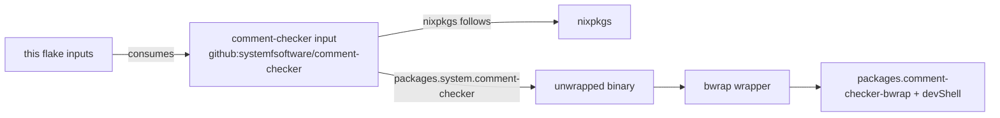

# feat: Pull comment-checker into the flake as a flake input

## Goal Capsule

- **Objective:** The flake gets the comment-checker binary from the comment-checker repo's own release pipeline, so releases are consumable without a human keeping asset hashes in sync.
- **Means:** Make `github:systemfsoftware/comment-checker` a flake input with `inputs.nixpkgs.follows = "nixpkgs"` and source `packages.<system>.comment-checker` from it (KTD1), mirroring the systemfsoftware repo's flake.
- **Authority:** No trajectory change; packaging-only. Existing `packages` attr names, bwrap wrapper shape, and devShell contents are preserved (R2, R3).
- **Stop conditions:** All requirements hold and the flake evaluates (`nix flake check`) with the input wired and the stale-hash machinery removed. Do not exceed scope into the plugin hook or PATH-binary issues from the debug session — those are recorded as deferred.
- **Tail ownership:** ce-work executes this plan; ce-simplify-code / ce-code-review review the diff; ce-commit-push-pr ships it.

---

## Product Contract

### Summary

The flake currently fetches the release binary via `pkgs.fetchurl` with four hard-coded SRI hashes (`flake.nix`). Asset hashes went stale once already (issue #81 — release served the 0.1.0 binary because flake.nix's hashes were set once in #48 and never updated). This change sources the binary from the comment-checker repo's own flake output instead, so the input's lockfile records the release and the hashes cannot drift.

### Problem Frame

Manual release-asset hash pinning is a maintenance trap: every release requires editing `flake.nix` (or running the sync script), and a missed sync silently serves the wrong binary. The sibling repo `systemfsoftware/systemfsoftware` already solved this by pulling `github:systemfsoftware/comment-checker` as a flake input whose `nixpkgs` follows its own; this repo should do the same, including keeping the bwrap sandbox wrapper.

### Requirements

- R1. `flake.nix` declares a `comment-checker` input (`github:systemfsoftware/comment-checker`) whose `inputs.nixpkgs.follows = "nixpkgs"` (matching `systemfsoftware/systemfsoftware`'s flake).
- R2. The `packages.<system>` surface is preserved: `comment-checker` = the unwrapped binary from the input, `comment-checker-bwrap` = the bwrap wrapper around it, `default` = the wrapped binary. This is an external contract — `systemfsoftware/systemfsoftware` consumes `comment-checker.packages.<system>.comment-checker`.
- R3. `devShells.default` keeps the wrapped `comment-checker` plus the existing Rust/JS toolchain (`rust-toolchain.toml` toolchain, cargo-mutants, gcc, nodejs, pnpm, bubblewrap); only the binary's sourcing changes.
- R4. `flake.lock` gains the `comment-checker` input and the lockfile is committed.
- R5. No test-suite additions or changes anywhere in the repo (session-settled: user-directed — no tests).
- R6. The dead release-asset machinery is removed: `version`, per-platform `target`/`hash` maps, and `mkCommentChecker` no longer exist, so no stale-hash path remains.

### Scope Boundaries

- **Deferred to Follow-Up Work:** the plugin-hook crash (`LD_FOR_BUILD` NotCapable in `hooks/run.ts` under the nix devshell) and the stale `0.1.0` binary on PATH are diagnosed in the debug session but are out of scope here; the devshell now serving the current version through the input partially mitigates the PATH issue.

---

## Planning Contract

### Key Technical Decisions

- KTD1. **Source comment-checker from a flake input, not fetchurl + hashes.** (session-settled: user-directed — chosen over keeping the fetchurl-with-hash map: the input's lockfile pins releases without manual hash sync, killing the #81 failure class.)
- KTD2. **No tests for this change.** (session-settled: user-directed — chosen over adding regression coverage: user directed "No tests"; the change is packaging config, so verification is flake evaluation plus a runtime smoke of the wrapped binary, not a test suite.)
- KTD3. **Preserve the existing package attr names and the wrapped `default`.** Chosen over renaming or dropping the wrapper: `systemfsoftware/systemfsoftware` consumes `packages.<system>.comment-checker`, and the devShell's sandboxed binary depends on the bwrap wrapper staying available (R2, R3).

### Assumptions

- The input repo's flake exposes `packages.<system>.comment-checker` (its `default` is the wrapped binary; the unwrapped attr is the one to consume). Verified against the input's own `flake.nix` at planning time.
- The input's release assets for the latest tag are current and correct (the #81 hash drift was release-asset *hashes in this repo's flake*, not the assets themselves — those were verified correct in the debug session).
- Network access to GitHub is available for `nix flake lock` and the input fetch.

### High-Level Technical Design

No new components; the shape is the systemfsoftware repo's flake adapted to this repo's existing wrapper and devShell.

---

## Implementation Units

### U1. Rewire flake.nix to the flake input

- **Goal:** `flake.nix` sources comment-checker from the input and stops pinning release hashes.
- **Requirements:** R1, R2, R6.
- **Dependencies:** none.
- **Files:** `flake.nix`
- **Approach:**
  1. Add the `comment-checker` input (`github:systemfsoftware/comment-checker`, `inputs.nixpkgs.follows = "nixpkgs"`) alongside the existing `nixpkgs` and `rust-overlay` inputs.
  2. Add `comment-checker` to the `outputs` arguments.
  3. Delete `mkCommentChecker`, `target`, `hash`, and `version`; resolve the binary as `comment-checker.packages.${pkgs.system}.comment-checker` inside the `let` block.
  4. Keep `mkBwrap` unchanged (it takes the unwrapped binary and wraps it); keep `packages` and `devShells` attr names and composition.
- **Patterns to follow:** `systemfsoftware/systemfsoftware/flake.nix` (input declaration, `follows`, `packages.<system>.comment-checker` consumption); this repo's existing `mkBwrap` (unchanged).
- **Test scenarios:** none.
  - `Test expectation: none -- config-only packaging change; user-directed no-test policy (KTD2); behavior is verified by flake evaluation (U3).`
- **Verification:** `flake.nix` parses and attributes resolve: `nix eval .#packages.x86_64-linux.comment-checker`, `nix eval .#packages.x86_64-linux.comment-checker-bwrap`, `nix eval .#devShells.x86_64-linux.default` succeed with no fetchurl/hash references remaining in `flake.nix`.

### U2. Lock the comment-checker input

- **Goal:** `flake.lock` records the new input.
- **Requirements:** R4.
- **Dependencies:** U1 (input declaration must exist).
- **Files:** `flake.lock`
- **Approach:** Run `nix flake lock` (or `nix flake update comment-checker`) and commit the resulting lockfile change; confirm the lock now contains a `comment-checker` node with its `nixpkgs` following this repo's.
- **Test scenarios:** none.
  - `Test expectation: none -- lockfile update; verified by U3's evaluation.`
- **Verification:** `nix flake lock` exits 0 and `flake.lock` gains the `comment-checker` input node.

### U3. Verify evaluation and the wrapped binary

- **Goal:** The flake evaluates end-to-end and the devShell serves a working, sandboxed comment-checker of the current version.
- **Requirements:** R2, R3.
- **Dependencies:** U2.
- **Files:** none (verification only).
- **Approach:** Build and smoke-test through the flake's own surfaces rather than any test suite (KTD2):
  1. `nix flake check` — full flake evaluation gate.
  2. `nix build .#packages.x86_64-linux.comment-checker-bwrap` (or `nix develop -c comment-checker --version`), asserting the version reported matches the input's current release, not `0.1.0`.
  3. Pipe a real `PostToolUse` hook JSON payload into the wrapped binary and confirm it classifies comments (exit 0 on clean or 2 with a report on flagged input) — proving the bwrap wrapper still works against the substituted binary.
- **Test scenarios:** none.
  - `Test expectation: none -- runtime smoke per KTD2; this unit's proof is the evaluation and smoke commands above, not committed tests.`
- **Verification:** `nix flake check` passes; `comment-checker --version` prints the input's release version; the payload smoke exits with the expected code and report.

---

## Verification Contract

- Flake gate (this plan's only gate — no Rust/JS code changes): `nix flake check`
- Attribute resolution: `nix eval .#packages.x86_64-linux.comment-checker-bwrap`
- Runtime smoke: build/enter the devShell and run `comment-checker --version` plus a piped hook payload against the bwrap-wrapped binary.
- No test suites run or added (KTD2 / R5).

## Definition of Done

- [ ] `flake.nix` sources comment-checker from the input and contains no `fetchurl`/hash/release-asset machinery (R1, R6)
- [ ] `packages.<system>.{comment-checker,comment-checker-bwrap}` and `default` are preserved (R2)
- [ ] devShell contents unchanged apart from binary sourcing (R3)
- [ ] `flake.lock` updated and committed with the input (R4)
- [ ] `nix flake check` passes; wrapped binary reports the current release version (U3)
- [ ] No test files added or modified (R5)