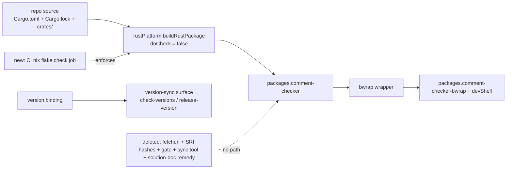

# feat: Build comment-checker from source in-flake, drop fetchurl hashes

## Goal Capsule

- **Objective:** The flake serves a comment-checker binary that always matches the repo's current source, with no release-asset hashes for a human or release step to keep in sync; the #81 stale-binary failure class is eliminated by construction.
- **Means:** Delete the `pkgs.fetchurl`-based `mkCommentChecker` and build from the repo tree with `rustPlatform` (KTD1); keep the `version` binding and the bwrap wrapper (KTD2); delete the now-obsolete hash gate/sync machinery (KTD3); add a CI nix-evaluation gate so flake correctness stays enforced after merge (KTD4).
- **Authority:** Packaging-only change; package attr names and devShell composition preserved (R2, R3).
- **Stop conditions:** All requirements hold; `nix flake check` passes locally and in CI; `check-versions.ts` stays green; no fetchurl/hash/release-asset references remain in the flake. Scope does not extend into the plugin-hook bug or PATH-binary issues from the debug session (deferred).
- **Tail ownership:** ce-work implements; ce-simplify-code / ce-code-review review; ce-commit-push-pr ships (including the new CI nix job).

---

## Product Contract

### Summary

`flake.nix` currently fetches release binaries via `pkgs.fetchurl` with four hard-coded SRI hashes (master #82 added a publish-time sync PR and a recomputing CI gate to keep them current). This change stops fetching entirely: the binary is built in-flake from the repo's own source via `rustPlatform`, so there are no hashes to drift and the #81 failure class (flake serving stale bytes under a newer version) cannot recur by construction. The `version` binding stays so the repo's version-sync tooling keeps working; the fetchurl-only machinery — SRI hash gate, sync tool, and release step — is deleted cleanly (solution doc updated to match, not left describing dead machinery). A CI `nix flake check` job replaces the deleted hash gate as the shipped flake-evaluation gate.

The prior flake-input approach (consuming `github:systemfsoftware/comment-checker` as a flake input, as systemfsoftware/systemfsoftware does) was invalidated at review and is superseded by this document.

### Problem Frame

Manual release-asset hash pinning is a maintenance trap: fixed-output derivations cache by name + declared hash, so a stale hash silently serves old bytes (issue #81: 0.1.0-era binary under the 0.3.2 name). #82 built four layers around the symptom — fresh hashes, publish-time sync PR, recomputing CI gate, `--version` smoke — all preserving the fetchurl design. The root fix is to stop fetching: a source build has no FOD hash to go stale, and the devshell then serves the current tree. The `--version` smoke (run-binary-smoke.ts in platform.yml, which smokes release binaries) is not fetchurl-era flake machinery and stays.

### Requirements

- R1. `flake.nix` builds the comment-checker binary from the repo's own source via `rustPlatform`; no `fetchurl`, no release-asset URLs, no SRI hash map remains.
- R2. The `packages.<system>` surface is preserved exactly: `comment-checker` (the built binary), `comment-checker-bwrap` (the bwrap wrapper), `default` = the wrapped binary. External contract — downstream repos consume `packages.<system>.comment-checker`.
- R3. `devShells.default` changes only in how the binary is sourced (source-built instead of fetched); the Rust/JS toolchain (`rust-toolchain.toml` toolchain, cargo-mutants, gcc, nodejs, pnpm, bubblewrap) is unchanged.
- R4. The obsolete fetchurl-era machinery is removed, not orphaned: the `checkFlakeHashes` gate and its error classes, `scripts/tools/sync-flake-hashes.ts`, the `release.yml` hash-sync step, and the now-unused `sriFromSha256`/`unixTargetTriples` exports. The #81 solution doc (`docs/solutions/integration-issues/flake-fod-hash-drift-stale-binary.md`) is updated to describe the source build as the remedy, not the deleted machinery. `run-binary-smoke.ts` is explicitly out of scope — it smokes release binaries, not flake hashes.
- R5. The `version = "x.y.z"` binding stays in `flake.nix` and the version-sync surface it feeds (`bumpAllSurfaces`/`checkAllSurfaces`) remains green — releases keep bumping flake.nix's version.
- R6. CI enforces flake evaluation: a `nix flake check` job runs on PRs, so a flake that breaks evaluation or reintroduces a fetch fails the gate, not just the implementer's local run.
- R7. The source build does not run the crate's test suite during `nix build`/`nix develop` (`doCheck = false`), honoring the no-test decision.
- R8. No test-suite additions or changes anywhere (session-settled: user-directed — no tests).

### Scope Boundaries

- **Deferred to Follow-Up Work:** the plugin-hook `LD_FOR_BUILD` `NotCapable` crash (`hooks/run.ts`), the stale `0.1.0` binary on PATH, and the `--strip` under bwrap read-only-mount tension — diagnosed in the debug session, out of scope here.

---

## Planning Contract

### Key Technical Decisions

- KTD1. **Build from source in-flake via `rustPlatform`; delete the fetchurl derivation.** (session-settled: user-directed — chosen over keeping fetchurl+hashes with the #82 gates, and over the flake-input approach invalidated at review: a source build leaves no FOD hash to drift, killing the #81 class by construction.) The build uses the existing `Cargo.toml`/`Cargo.lock` and `.cargo/config.toml` (static tree-sitter grammars) with no new toolchain.
- KTD2. **Keep the `version` binding in `flake.nix`.** (session-settled: user-directed — chosen over deleting it: the version-sync tooling (`extractNixVersion` through `checkAllSurfaces`/`bumpAllSurfaces`) hard-requires exactly one binding and fails CI otherwise; keeping it preserves the release-version surface. The fetch-tag `version` moves to the derivation's `version` attr.) The obsolete *hash* machinery (R4) is removed separately; only the version string survives.
- KTD3. **Delete the fetchurl-era hash machinery** — `checkFlakeHashes` and its error classes, `sync-flake-hashes.ts`, the release.yml hash-sync step, `sriFromSha256`/`unixTargetTriples` — and update the #81 solution doc so no standing instruction references the deleted mechanism (DEL1; git grep must find zero survivors incl. docs/).
- KTD4. **Add a CI `nix flake check` job.** The deleted `checkFlakeHashes` gate was the only CI-touching check of flake.nix on master (tools.yml runs check-versions.ts; no workflow runs nix). Removing it without a replacement would leave flake evaluation unenforced after merge — the exact drift-undetected failure mode #81/#82 existed to kill. A `determinatesystems/setup-nix` + `nix flake check` job on ubuntu-latest in ci.yml enforces it shipped.
- KTD5. **No tests for this change.** (session-settled: user-directed — chosen over adding coverage: the change is packaging config; verification is flake evaluation plus a runtime smoke, not a test suite. `doCheck = false` keeps the flake build itself from running the crate's tests.)

### Assumptions

- `rustPlatform.buildRustPackage` with `cargoLock.lockFile = ./Cargo.lock` builds the crate under nixpkgs-unstable's Rust toolchain (sufficient for a workspace with one crate; the repo's `.cargo/config.toml` env (`TSLP_LANGUAGES`, `TSLP_LINK_MODE=static`) is honored because the config lives in the source tree cargo reads). Default `doCheck = true` is overridden to `false` per R7.
- First source build costs a multi-minute compile (tree-sitter + ~37 static grammars under LTO fat) per lock revision; `nix develop` inherits it. Accepted as the cost of KTD1; the fetchurl path was a ~seconds download.
- The repo-root Cargo workspace (`Cargo.toml` with `members = ["crates/*"]`, root `Cargo.lock`, `.cargo/config.toml`) is the build surface; `npm/packages/comment-checker` is a TS launcher with no Cargo workspace.
- Master (4e8e34c3d, #82) is the merge base; this plan's file list matches master's tree as verified at plan time.

### High-Level Technical Design

No new components; the fetchurl derivation is replaced by a source build, the hash-only machinery is deleted, and CI enforces flake evaluation.

---

## Implementation Units

### U1. Build comment-checker from source in flake.nix

- **Goal:** `flake.nix` builds the binary from the repo tree; fetchurl, hash map, and per-platform target map are gone; the build does not run tests.
- **Requirements:** R1, R2, R3, R5, R7.
- **Dependencies:** none.
- **Files:** `flake.nix`
- **Approach:**
  1. Keep the `nixpkgs` and `rust-overlay` inputs and the `forAllSystems` shape unchanged.
  2. Replace `mkCommentChecker`'s `fetchurl` body with `pkgs.rustPlatform.buildRustPackage { pname = "comment-checker"; inherit version; src = ./.; cargoLock.lockFile = ./Cargo.lock; doCheck = false; }` — one derivation for all systems, no target/hash maps. `doCheck = false` is intentional: `buildRustPackage` defaults to `true` (running `cargo test` in the sandbox), which would violate R8.
  3. Optionally scope `src` with `lib.fileset` (e.g. `lib.fileset.unions [ ./Cargo.toml ./Cargo.lock ./crates ./.cargo ]`) so unrelated repo edits do not change the derivation hash and force rebuilds. Optional: plain `src = ./.` is acceptable for this scale.
  4. Keep the `version` binding and pass it to the derivation.
  5. Keep `mkBwrap` unchanged; keep `packages` attr names (`comment-checker`, `comment-checker-bwrap`, `default`) and the devShell's use of the wrapped binary.
- **Patterns to follow:** the repo-root Cargo workspace (`Cargo.toml` with `members = ["crates/*"]`, root `Cargo.lock`, `.cargo/config.toml`) — the surface U1's `buildRustPackage` consumes; `mkBwrap` unchanged; the flake's existing `forAllSystems`. (Not `npm/packages/comment-checker` — that is a TS launcher with no Cargo workspace.)
- **Test scenarios:** none.
  - `Test expectation: none -- config-only packaging change; user-directed no-test policy (R8); behavior verified by flake evaluation (U3).`
- **Verification:** `nix flake check` and attribute resolution succeed for `packages.<sys>.comment-checker`, `packages.<sys>.comment-checker-bwrap`, and `devShells.<sys>.default`; `flake.nix` contains no `fetchurl`, `hash`, or release-asset URL; the build does not invoke `cargo test` (observable via build log/`doCheck`).

### U2. Remove the fetchurl-era hash machinery

- **Goal:** No dead hash path remains (DEL1): the SRI gate, sync tool, release step, and solution-doc remedy are deleted; the version-sync surface stays green.
- **Requirements:** R4, R5.
- **Dependencies:** U1.
- **Files:** `scripts/lib/version-files.ts`, `scripts/tools/check-versions.ts`, `scripts/tools/sync-flake-hashes.ts` (delete), `scripts/lib/shared.ts`, `.github/workflows/release.yml`, `docs/solutions/integration-issues/flake-fod-hash-drift-stale-binary.md`
- **Approach:**
  1. Delete `scripts/tools/sync-flake-hashes.ts` (its only job was rewriting the fetched hashes; U1 removes the fetch).
  2. Remove the `Sync flake.nix release asset hashes` step from `release.yml` (currently runs `sync-flake-hashes.ts`).
  3. In `version-files.ts`: delete `checkFlakeHashes` and its `FlakeHashMismatch`/`FlakeTagMissing`/`FlakeRemoteUnreachable` classes; drop the `checkFlakeHashes()` call at the end of `checkAllSurfaces` (the version-surface check on `flake.nix` **stays** — that is R5). Delete the now-unused `Crypto`/`Stream`/`ChildProcess` imports and helpers they existed for.
  4. In `check-versions.ts`: drop the `flakeHashes` reporting branch from the program.
  5. In `shared.ts`: remove `sriFromSha256` and `unixTargetTriples` (now consumed by nothing; verified via `git grep` against master — only the gate and the deleted sync tool used them).
  6. Update the #81 solution doc (`docs/solutions/integration-issues/flake-fod-hash-drift-stale-binary.md`) so the "Prevention" remedy section describes the in-flake source build instead of the deleted sync/gate machinery. The #81 failure-mode analysis stays valid; only the documented remedy changes. The doc is part of DEL1's "zero surviving references" scope.
- **Patterns to follow:** the repo's own DEL1 discipline — delete the definition, callers, and rules together; `git grep` to prove zero survivors.
- **Test scenarios:** none.
  - `Test expectation: none -- script/workflow/doc removal; verified by the tools gate passing (U3), grep-proven absence of the removed names (incl. docs/), and the solution doc's updated remedy.`
- **Verification:** `git grep` for `sync-flake`, `sriFromSha256`, `unixTargetTriples`, `checkFlakeHashes`, `FlakeHashMismatch`, `FlakeTagMissing`, `FlakeRemoteUnreachable`, `flakeHashes` returns zero hits (including `docs/`); `./scripts/tools/check-versions.ts` exits 0 (version surface intact, hash gate gone).

### U3. Add CI nix-evaluation gate

- **Goal:** Flake evaluation is enforced by CI, not just the implementer's local run.
- **Requirements:** R6.
- **Dependencies:** U1 (the flake must evaluate before the job can pass).
- **Files:** `.github/workflows/ci.yml` (or a new `nix.yml` included from ci.yml)
- **Approach:**
  1. Add a `nix` job to ci.yml (ubuntu-latest) using `determinatesystems/setup-nix` (or equivalent pinned action).
  2. Run `nix flake check` (which evaluates all outputs, including the buildRustPackage derivation and the bwrap wrapper) plus the attribute-resolution check `nix eval .#packages.x86_64-linux.comment-checker-bwrap`.
  3. Gate the job on the same PR conditions as the other CI jobs.
- **Patterns to follow:** the repo's existing ci.yml job structure; the flake gate the plan's Verification Contract names.
- **Test scenarios:** none.
  - `Test expectation: none -- CI workflow config; verified by the job passing on the PR (U4's verification).`
- **Verification:** the `nix` job is present in ci.yml and passes on the PR for this change.

### U4. Verify evaluation, version surface, and smoke the built binary

- **Goal:** The flake evaluates, the tools gate stays green, CI enforces the flake, and the devshell serves a working, sandboxed binary of the current version.
- **Requirements:** R1, R2, R3, R5, R6, R7, R8.
- **Dependencies:** U2, U3.
- **Files:** none (verification only).
- **Approach:** Runtime smoke through the flake's own surfaces — the repo's gate commands, not a test suite (R8):
  1. `nix flake check` — full flake evaluation gate (also now the CI job from U3).
  2. `nix build .#packages.x86_64-linux.comment-checker-bwrap` (or `nix develop -c comment-checker --version`), asserting the reported version equals the `Cargo.toml` workspace version (0.3.2) — not the stale 0.1.0.
  3. Pipe a real `PostToolUse` hook JSON payload into the wrapped binary and confirm it classifies comments (exit 0 on clean input, 2 with a report on flagged input) — proving the bwrap wrapper still works against the source-built binary.
  4. `./scripts/tools/check-versions.ts` exits 0 (this is the PR tools gate from `tools.yml`; it now checks the version surface only).
- **Test scenarios:** none.
  - `Test expectation: none -- runtime smoke per R8; proof is the evaluation and smoke commands above, not committed tests.`
- **Verification:** all four commands above succeed with the stated outcomes.

---

## Verification Contract

- Flake gate (primary; also shipped as a CI job per R6): `nix flake check`
- Attribute resolution: `nix eval .#packages.x86_64-linux.comment-checker-bwrap`
- Version surface gate: `./scripts/tools/check-versions.ts` exits 0 (tools job in CI runs it on 3 OSes)
- Removal proof: `git grep` (incl. docs/) returns zero hits for `sync-flake`, `sriFromSha256`, `unixTargetTriples`, `checkFlakeHashes`, `FlakeHashMismatch`, `FlakeTagMissing`, `FlakeRemoteUnreachable`, `flakeHashes` — grep must match the actual symbols)
- Runtime smoke: build/enter the devShell, run `comment-checker --version` (must equal the Cargo workspace version) and a piped hook payload against the bwrap-wrapped binary
- Build hygiene: the derivation sets `doCheck = false` (no test suite run)
- No test suites run or added (R8)

## Definition of Done

- [ ] flake.nix builds from source; zero `fetchurl`/`hash`/release-asset references remain (R1)
- [ ] `packages.<system>.{comment-checker,comment-checker-bwrap}` and `default` preserved (R2)
- [ ] devShell contents unchanged apart from binary sourcing (R3)
- [ ] `sync-flake-hashes.ts`, the release.yml hash-sync step, the `checkFlakeHashes` gate, and the shared SRI helpers are deleted with zero surviving references — checked by `git grep` including `docs/` (R4)
- [ ] `version` binding kept; `check-versions.ts` exits 0 (R5)
- [ ] CI runs `nix flake check` on PRs (R6)
- [ ] `doCheck = false` in the derivation; build log shows no `cargo test` (R7)
- [ ] No test files added or modified (R8)